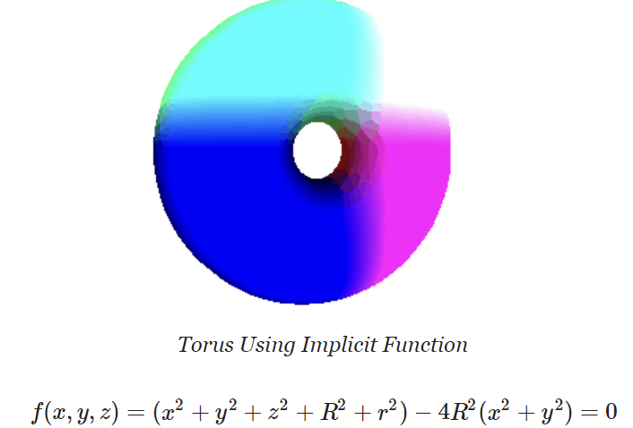

# CMSC848F-3D-Vision
This repository serves as a record of my academic experience in CMSC848F during the Fall of 2023. It includes my paper reviews, solutions, and code submissions for assignments and projects. Each assignment is organized within its respective folder, complete with accompanying documentation and any necessary resources.

## 📚 Course Overview
This 3D Computer Vision course provides a comprehensive journey through the principles and applications of three-dimensional visual data. It focuses on 5 key modules:
 
 **1. Background** : This module covers fundamental concepts, including 2D - 3D basics, 2.5D, layered depth images, multi-plane images, voxels, meshes, point clouds, and implicit representations.
 
 **2. Classical Multi-view Geometry** : This module includes learnining 	3D Representations, Multiview Depth Estimation, Structure from Motion (SfM) and Simultaneous Localization and Mapping (SLAM)
 
 **3. Single-View 3D** : This module focuses on single-view 3D techniques. Students gain insight into single-view 3D representation methods, monocular depth estimation, and surface normal estimation.
 
 **4. 3D Scene Representations & Neural Rendering** : Building on the fundamentals, this module explores advanced view synthesis techniques and implicit surface rendering approaches.
 
 **5. 3D Processing and Generation** :This module helps develop proficiency in processing point clouds, covering classification, segmentation, and detection. Additionally, we delve into techniques for processing mesh representations, understanding generative models for 3D data, and exploring dynamic aspects of 3D data.

## 📄 Assignment List
- Click [here](https://github.com/848f-3DVision) to access CMSC848f Assignments directly.
- Click [here](https://github.com/848f-3DVision) to access outputs of all projects on my Website.
### [Assignment 1](https://github.com/Rishikesh-Jadhav/CMSC848F-3D-Vision/tree/main/Assignment1): Rendering with Pytorch3D

- **Learnings from Assignment 1**:

  1. __Rendering First Mesh:__ Acquired a basic understanding of mesh rendering using PyTorch3D.

  2. __Practicing with Cameras:__ Created 360-degree gifs and set camera viewpoints for rendering.

  3. __Re-creating the Dolly Zoom:__ Successfully implemented the Dolly Zoom effect in PyTorch3D.
     

  4. __Practicing with Meshes:__ Created and rendered 3D shapes such as a tetrahedron and a cube.

  5. __Re-texturing a Mesh:__ Changed mesh colors based on vertex positions.

  6. __Camera Transformations:__  Implemented camera pose transformations for rendering.

  7. __Rendering Generic 3D Representations:__ Rendered point clouds and constructed them from RGB-D images. Parametrically generated and rendered point clouds.
     
   
  8. __Implicit Surfaces:__ Utilized implicit functions to define surfaces and converted them to meshes. Rendered a torus mesh with an implicit function and discussed mesh vs. point cloud rendering trade-offs.
   
   
  
### [Assignment 2](https://github.com/Rishikesh-Jadhav/CMSC848F-3D-Vision/tree/main/Assignment2):  Single View to 3D

- **Learnings from Assignment 2**:

  1. __Exploring Loss Functions:__
     - *Fitting a Voxel Grid :* Understood and implemented binary cross-entropy loss for regressing to 3D binary voxel grids.
     - *Fitting a Point Cloud :* Successfully implemented Chamfer loss for fitting 3D point clouds and wrote custom code for this purpose.
     - *Fitting a Mesh :*  Defined a smoothening loss for fitting a 3D mesh, utilizing pre-defined losses in the PyTorch library.
       
  2. __Reconstructing 3D from Single View:__
     - *Designed an Image to Voxel Grid Model :* Created a neural network to decode binary voxel grids, possibly modifying the provided decoder, and trained the single-view to voxel grid pipeline.
     - *Developed an Image to Point Cloud Model :* Designed a neural network to decode point clouds, similar to voxel grid, and trained the single-view to point cloud pipeline.
     - *Defined an Image to Mesh Model :* Developed a neural network to decode meshes, modified the provided decoder, and trained the single-view to mesh pipeline. Experimented with different mesh initializations.
     - *Conducted Quantitative Comparisons :* Compared F1 scores of 3D reconstruction for meshes, point clouds, and voxel grids and justified the comparison with an intuitive explanation.
     - *Analyzed Effects of Hyperparameter Variations :* Investigated the impact of varying hyperparameters, such as n_points, vox_size, w_chamfer, or initial mesh, on the model's performance.
     - *Interpreted Your Model :* Created insightful visualizations to understand what the learned model does and gained insights into its behavior. This included visualizing feature maps and encoder information.

These learnings encompass a wide range of topics related to 3D reconstruction from single-view RGB input, loss functions, neural network design, and hyperparameter tuning. Additionally, they include the use of PyTorch and PyTorch3D for   implementing these concepts.  
    
### [Assignment 3](https://github.com/Rishikesh-Jadhav/CMSC848F-3D-Vision/tree/main/Assignment3):  Volume Rendering and Neural Radiance Fields

- **Learnings from Assignment 3**:
  1. **Differentiable Volume Rendering:**

      - **Ray Sampling:** Learned how to generate world space rays from camera positions and pixel coordinates using PyTorch3D. 

      - **Point Sampling:** Implemented a stratified sampler to generate sample points along each ray, taking into account near and far distances. Explored visualization of sample points.

      - **Volume Rendering:** Implemented a volume renderer that evaluates a volume function at each sample point along a ray, aggregates these evaluations, and renders color and depth information. Explored volume density and color computations based on the emission-absorption model.

  2. **Optimizing a Basic Implicit Volume:**

      - **Random Ray Sampling:** Implemented random ray sampling to optimize the position and side lengths of a 3D box. Explored the concept of training on a subset of rays to save memory.

      - **Loss and Training:** Replaced loss functions with Mean Squared Error (MSE) between predicted colors and ground truth colors (rgb_gt). Conducted training and reported the center and side lengths of the optimized box.

      - **Visualization:** Created a spiral rendering of the optimized volume and compared it with a reference gif.

  3. **Optimizing a Neural Radiance Field (NeRF):**
      
      - **NeRF Implementation:** Implemented an implicit volume as a Multi-Layer Perceptron (MLP) to map 3D positions to volume density and color. Utilized ReLU activation for density and Sigmoid activation for color. Explored the use of Positional Encoding for improved quality.

      - **Loss and Training:** Wrote the loss function for training the NeRF model on RGB images. Explored data loading, training, and checkpointing.Trained NeRF on the lego bulldozer dataset

      - **Visualization:** Trained a NeRF on a specific dataset and created a spiral rendering of the optimized volume. Reported the results and compared them to reference visuals.

These learnings encompass various aspects of differentiable volume rendering, 3D optimization, and the implementation of Neural Radiance Fields.

### [Assignment 4](https://github.com/Rishikesh-Jadhav/CMSC848F-3D-Vision/tree/main/Assignment4): Point Cloud Classification and Segmentation

- **Learnings from Assignment 4**:
  1. **Classification Model Implementation:**
   - Developed an understanding of implementing a PointNet-based architecture for point cloud classification.
   - Learned to define model structures, handling input points from multiple classes (chairs, vases, lamps).
   - Explored model initialization, training, and testing procedures.

2. **Segmentation Model Implementation:**
   - Gained insights into implementing a PointNet-based architecture for point cloud segmentation.
   - Defined the model structure for segmentation tasks focusing on chair objects.
   - Executed model initialization, training, and segmentation result visualization.

3. **Experimentation and Robustness Analysis:**
   - Conducted two robustness experiments to evaluate the model's performance under different conditions.
   - Explored rotation of input point clouds by 15, 45, 90 degrees and varying the number of points per object by 10000, 5000, 1000 .
   - Analyzed how these variations affected test accuracy and visually interpreted the results.

The completion of Assignment 4 provided a comprehensive hands-on experience with PointNet architectures, further strengthening skills in 3D vision tasks, neural network implementation, and robustness analysis in the context of point cloud data.

## 📝 Paper Reviews and Presentations
In our course, we've delved in cutting-edge research. This section showcases a selection of academic papers that we've not only read but also reviewed carefully, presented, and discussed in our class. These papers represent a diverse range of topics and discoveries in the field of 3D vision, offering valuable insights.
 
 **1. [Multi-Scale Geometric Consistency Guided Multi-View Stereo](https://openaccess.thecvf.com/content_CVPR_2019/papers/Xu_Multi-Scale_Geometric_Consistency_Guided_Multi-View_Stereo_CVPR_2019_paper.pdf)** : Explore the world of multi-view stereo reconstruction with a focus on geometric consistency.

- **[Review](https://github.com/Rishikesh-Jadhav/CMSC848F-3D-Vision/blob/main/reviews_and_presentations/reviews/Rishikesh_group3_MVS_paper%20_review.docx.pdf)**
- **[Presentation](https://github.com/Rishikesh-Jadhav/CMSC848F-3D-Vision/blob/main/reviews_and_presentations/presentations/CMSC%20848F%20paper%20review%201.pdf)**
 
 **2. [Structure-from-Motion Revisited](https://openaccess.thecvf.com/content_cvpr_2016/papers/Schonberger_Structure-From-Motion_Revisited_CVPR_2016_paper.pdf)** : A Fresh Perspective on the role of SFM in Computer Vision.
 
 - **[Review](https://github.com/Rishikesh-Jadhav/CMSC848F-3D-Vision/blob/main/reviews_and_presentations/reviews/Rishikesh_group1_SFM_paper_review.docx.pdf)**
 - **[Presentation](https://github.com/Rishikesh-Jadhav/CMSC848F-3D-Vision/blob/main/reviews_and_presentations/presentations/SfM%20and%20SLAM%20presentation.pdf)**

 **3. [Omnidata: A Scalable Pipeline for Making Multi-Task Mid-Level Vision Datasets from 3D Scans](https://arxiv.org/abs/2110.04994)** : Find out how the authors put together datasets for all sorts of vision tasks from 3D scans.

- **[Review](https://github.com/Rishikesh-Jadhav/CMSC848F-3D-Vision/blob/main/reviews_and_presentations/reviews/Rishikesh_group6_Single-view%203D%20(2.5D)_paper_review.pdf)**
- **[Presentation](https://github.com/Rishikesh-Jadhav/CMSC848F-3D-Vision/blob/main/reviews_and_presentations/presentations/omnidata_presentation.pdf)**
  
 **4. [What Do Single-view 3D Reconstruction Networks Learn?](https://arxiv.org/abs/1905.03678)** :  Ever wondered what single-view 3D reconstruction networks are up to? 

- **[Review](https://github.com/Rishikesh-Jadhav/CMSC848F-3D-Vision/blob/main/reviews_and_presentations/reviews/Rishikesh_paper4_review.pdf)**
- **[Presentation](https://github.com/Rishikesh-Jadhav/CMSC848F-3D-Vision/blob/main/reviews_and_presentations/presentations/What%20Do%20Single-view%20Reconstruction%20Networks%20Learn%20presentation.pdf)**

 **5. [Learning Category-Specific Mesh Reconstruction from Image Collections](https://arxiv.org/abs/1803.07549)** :  Dive into category-specific mesh reconstruction from image collections .

- **[Review](https://github.com/Rishikesh-Jadhav/CMSC848F-3D-Vision/blob/main/reviews_and_presentations/reviews/Rishikesh_group4_Single-view%203D%20(Unsupervised)_paper_review.pdf)**
- **[Presentation](https://github.com/Rishikesh-Jadhav/CMSC848F-3D-Vision/blob/main/reviews_and_presentations/presentations/Learning%20Category-Specific%20Mesh%20Reconstruction%20from%20Image%20Collections.pdf)**

 **6. [DynIBaR: Neural Dynamic Image-Based Rendering](https://arxiv.org/abs/2211.11082)** :  Explore DynIBaR, a neural network model that enables realistic dynamic scene synthesis from a single image.
 
- **[Review](https://github.com/Rishikesh-Jadhav/CMSC848F-3D-Vision/blob/main/reviews_and_presentations/reviews/Rishikesh_group2_Multiview3D(Nerfs)_paper_review.pdf)**
- **[Presentation]()**

 **7. [4D Spatio-Temporal ConvNets: Minkowski Convolutional Neural Networks](https://arxiv.org/abs/1904.08755)** : Discover 4D Spatio-Temporal ConvNets (Minkowski CNNs) for robust 3D video semantic segmentation using a trilateral space, variational inference, and sparse convolution
 
- **[Review](https://github.com/Rishikesh-Jadhav/CMSC848F-3D-Vision/blob/main/reviews_and_presentations/reviews/Rishikesh_4D%20Spatio-Temporal%20ConvNets_%20Minkowski%20Convolutional%20Neural%20Networks.pdf)**
- **[Presentation]()**
  
## Additional Resources
- [Course related resources](https://www.cs.umd.edu/class/fall2023/cmsc848f/)

